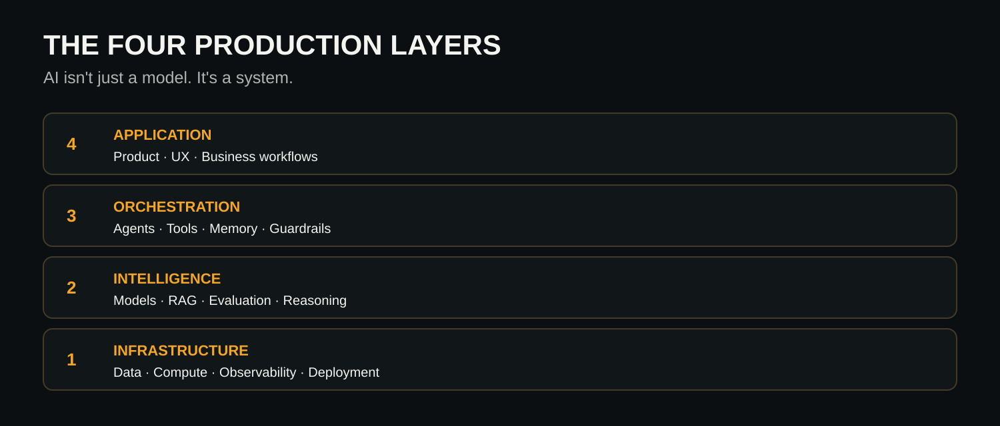
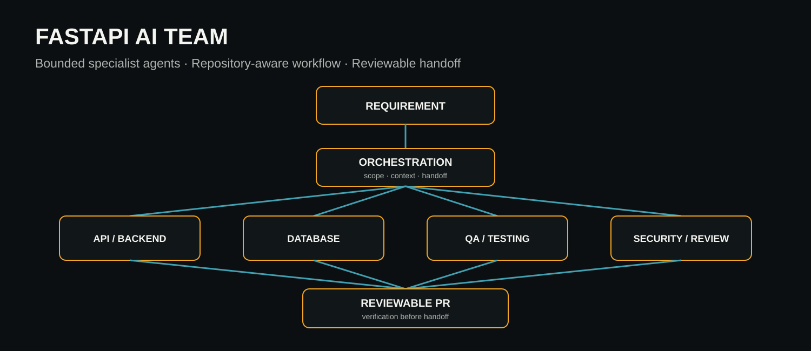
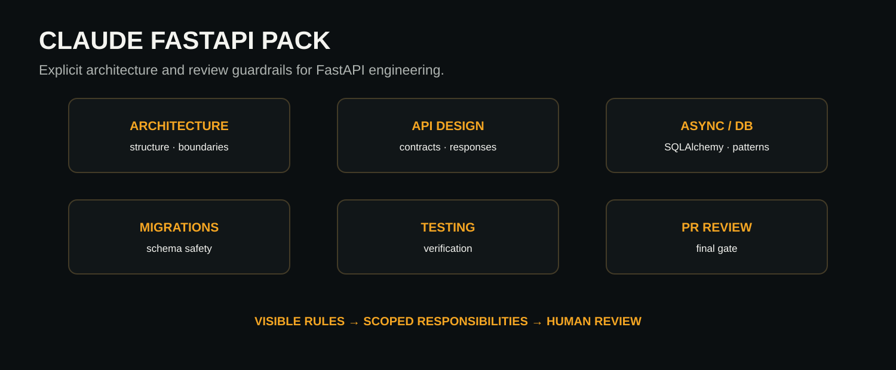

<div align="center">

# Uzair Khatri

### Production AI Systems Architect

**Fragile AI. Rebuilt for Production.**

I design and build the systems around AI models: agent orchestration, retrieval, evaluation, guardrails, observability, enterprise integration and cloud infrastructure.

[**View My Work**](https://uzairkhatri.com/case-studies/) · [**Book a 30-Min Strategy Call**](https://calendly.com/uz-khatri/30min) · [Website](https://uzairkhatri.com) · [LinkedIn](https://www.linkedin.com/in/uzair-khatri/)

</div>

---

## 👋 Hi, I'm Uzair

I'm an AI Solutions Architect and senior software engineer with **12+ years in software architecture and engineering**, focused on taking AI products from promising prototypes to systems teams can operate with confidence.

> **The model is rarely the system. It's the stress point.**

| **Production AI** | **Enterprise Architecture** | **AI Engineering** | **Cloud Native** |
|---|---|---|---|
| Agents · RAG · Evaluation | Distributed systems · Integrations | Python · FastAPI · Java | AWS · Kubernetes · Docker |

---

## 🚀 Featured Engineering

### 🛡️ [Production AI Readiness](https://github.com/uzairkhatri/production-ai-readiness)

**Catch production AI risks before the PR merges.**

A deterministic Python CLI that audits AI/LLM repositories across **8 readiness dimensions** and turns the findings into reviewable engineering evidence.

`Evaluation` · `Observability` · `Guardrails` · `RAG Quality` · `Security & PII` · `Reliability` · `Cost Controls` · `Human Oversight`

**Proof:** runnable CLI · tests · evidence locations · weighted scoring · JSON/Markdown/SARIF · GitHub Actions PR gate · demo applications

[Repository →](https://github.com/uzairkhatri/production-ai-readiness) · [Demo →](https://github.com/uzairkhatri/production-ai-readiness/blob/main/docs/demo.md)

### 🤖 [FastAPI AI Team](https://github.com/uzairkhatri/fastapi-ai-team)

Bounded AI engineering workflow with **11 specialist agents and 7 reusable skills**, designed around repository context, explicit responsibilities, verification and reviewable PR handoff.

**Proof:** public agent definitions · reusable skills · architecture workflow · examples

### ⚙️ [Claude FastAPI Pack](https://github.com/uzairkhatri/claude-fastapi-pack)

FastAPI engineering guardrails for architecture, API design, async/SQLAlchemy code, migrations and PR review.

**Proof:** reusable agents · commands · explicit human-review boundary

**[Explore selected work →](https://uzairkhatri.com/case-studies/)**

---

## 🧱 The Four Production Layers

My working model for AI systems that have to survive real users, real data and real failure modes.

<p align="center">
  
</p>

**AI isn't just a model. It's a system.** Each layer needs explicit engineering, verification and operational ownership.

[Read the Production AI Playbook →](https://uzairkhatri.com/ai-playbook/)

---

## 🎯 Current Focus

- **Agentic AI Systems** — bounded agents, tool contracts, state, memory and human approval
- **RAG & Knowledge Systems** — retrieval quality, grounding, reranking, citations and evaluation
- **LLMOps & Observability** — traces, quality signals, failure analysis, cost and reliability
- **Production Architecture** — scalable APIs, security boundaries, queues, caching and deployment
- **AI Engineering Workflows** — agent-assisted development with deterministic verification

---

## 🧰 Tech Stack

| | |
|---|---|
| **AI / LLM** | OpenAI · Claude · Gemini · RAG · Agentic Workflows · Evaluation |
| **Backend** | Python · FastAPI · Java · Spring Boot · REST APIs |
| **Data** | PostgreSQL · SQLAlchemy · Vector Retrieval · Caching |
| **Cloud / Platform** | AWS · Kubernetes · Docker · CI/CD · Observability |
| **Architecture** | Distributed Systems · Enterprise Integrations · Security · Scalability |
| **Engineering** | Git · GitHub · Testing · Code Review · Architecture Decision Records |

---

## 🧩 Architecture Proof

### FastAPI AI Team

<p align="center">
  
</p>

### Claude FastAPI Pack

<p align="center">
  
</p>

---

## 🧪 How I Approach Production AI

```text
Prototype
   │
   ▼
Define failure modes
   │
   ▼
Design boundaries + architecture
   │
   ▼
Build retrieval / agents / integrations
   │
   ▼
Evaluate + attack assumptions
   │
   ▼
Add observability + operational controls
   │
   ▼
Production
```

For security-critical and reliability-sensitive work, I prefer asking AI to **try to break the solution** rather than merely confirm that it works. Tests and explicit verification gates—not agent confidence—decide when work is ready.

---

## 📚 Production AI Field Notes

Topics I write and build around:

- Why AI agents fail after the demo
- Guardrails vs. better prompting
- Production RAG and retrieval quality
- Evaluation before scale
- Architecture decisions before expensive code
- AI-assisted engineering with bounded autonomy

**[Read the Production AI Playbook →](https://uzairkhatri.com/ai-playbook/)** · **[Follow on LinkedIn →](https://www.linkedin.com/in/uzair-khatri/)**

---

## 🎓 Selected Certification

**IBM — Machine Learning with Python**

I keep certifications secondary to production evidence: architecture decisions, shipped systems, open-source work and verifiable engineering contributions.

---

## 🤝 Work With Me

I am most useful when:

- an AI prototype needs to become a reliable production system;
- a RAG or agent system is difficult to trust, evaluate or operate;
- an engineering team needs senior AI/system architecture direction;
- a product needs deep enterprise integrations, security or cloud architecture.

### Have an AI system that needs to actually work?

[**View Selected Work**](https://uzairkhatri.com/case-studies/) · [**Explore Services**](https://uzairkhatri.com/services/ai-systems/) · [**Book a 30-Min Strategy Call**](https://calendly.com/uz-khatri/30min)

---

<div align="center">

**Production AI · Agentic Systems · RAG · Enterprise Architecture**

[uzairkhatri.com](https://uzairkhatri.com)

</div>
