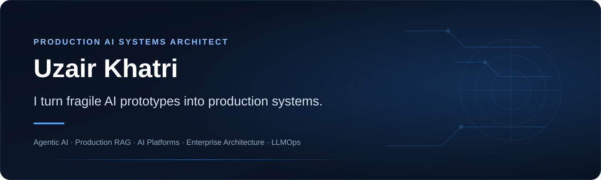

<p align="center">
  
</p>

<p align="center">
  
</p>

<p align="center">
  <a href="https://uzairkhatri.com"></a>
  <a href="https://uzairkhatri.com/case-studies/"></a>
  <a href="https://www.linkedin.com/in/uzair-khatri/"></a>
  <a href="https://calendly.com/uz-khatri/30min"></a>
</p>

<p align="center">
  
  
</p>

---

### ⚡ Executive Scale & Impact

| Metric | Engineering Proof & Production Benchmark |
| :--- | :--- |
| **14+ Years** | Architecting resilient distributed systems, enterprise workflows, and scalable backends |
| **1M+ Customers** | Engineered core ledger, partner APIs, and settlement flows processing 5,000+ daily transactions (*Savyour*) |
| **10K+ / Month** | Multi-agent autonomous remediation engine scoring LLM search citations across ChatGPT & Perplexity (*Wellows*) |
| **800ms → 120ms** | Production API latency reduction achieved through async refactoring, Redis caching, and SQS queue isolation |
| **<200ms Vector SLA** | Hybrid dense/sparse retrieval layer on Qdrant with deterministic value-presence abstention gates |

---

## 🏛️ The Four Production Layers

> *"The model is rarely the system. It's the stress point. Building reliable AI products requires explicit boundaries, measurable quality gates, and deterministic operational controls."*

<p align="center">
  
</p>

---

## 🛠️ Flagship Open-Source Architectures

### 1. [Production RAG Reference](https://github.com/uzairkhatri/production-rag-reference)
*FastAPI reference architecture for RAG systems that can be measured, evaluated, and operated with confidence.*

<p align="center">
  
</p>

* **Measurable Retrieval Gate:** Enforces **Recall@5 (0.9444)** and **MRR (0.9167)** regression floors in GitHub Actions CI before any code merges.
* **Deterministic Guardrails:** Value-presence verification rejects hallucinated metrics, versions, and prices before hitting generator endpoints.
* **Provider Independence:** Swappable interfaces supporting offline local execution and production OpenAI / Claude adapters.
* 👉 [**Explore Repository →**](https://github.com/uzairkhatri/production-rag-reference) · [Read Architecture Case Study](https://uzairkhatri.com/work/production-rag/)

---

### 2. [FastAPI AI Engineering Team](https://github.com/uzairkhatri/fastapi-ai-team)
*Autonomous multi-agent engineering runtime: 11 specialized agents and 7 architectural skills taking specifications to production PRs.*

<p align="center">
  
</p>

* **Isolated Task Boundaries:** Dedicated agents for API/Backend, Database, QA/Testing, and Security audit.
* **Deterministic State Machine:** Orchestrated through stateful handoffs with verification checks before PR submission.
* 👉 [**Explore Repository →**](https://github.com/uzairkhatri/fastapi-ai-team)

---

### 3. [Production AI Readiness CLI](https://github.com/uzairkhatri/production-ai-readiness)
*Deterministic Python CLI that audits AI/LLM codebases across 8 engineering dimensions before deployment.*

```text
git diff / codebase ──> [Audit Engine: 8 Dimensions] ──> GitHub Actions PR Gate (SARIF / JSON / MD)
```

* **8 Audit Dimensions:** Evaluates test coverage, prompt injection defenses, token budget ceilings, and human-in-the-loop approval gates.
* **Security & SARIF Integration:** Integrates into CI/CD pipelines to block risky AI patterns before pull requests merge.
* 👉 [**Explore Repository →**](https://github.com/uzairkhatri/production-ai-readiness) · [Explore AI Audit Advisory](https://uzairkhatri.com/services/ai-audit/)

---

## 📊 Engineering Telemetry & Activity

<p align="center">
  
  
</p>

---

## 💻 Production Tech Stack

<div align="left">

#### AI & Agentic Systems
<p>
  
  
  
  
  
  
  
  
  
  
</p>

#### Distributed Systems & Backend
<p>
  
  
  
  
  
  
  
  
  
</p>

#### Cloud, DevOps & Security
<p>
  
  
  
  
  
  
  
</p>

</div>

---

## 🏛️ Enterprise Production Case Studies

| Client / Product | Domain | Engineering Highlights | Case Study |
| :--- | :--- | :--- | :---: |
| **Wellows** | AI Search Visibility Platform | Multi-agent architecture (LangGraph + Qdrant) automating LLM citation scoring & content remediation at 10K+ articles/month. | [Read Case Study →](https://uzairkhatri.com/work/wellows/) |
| **Savyour** | High-Throughput Fintech | Decomposed monolith into 12 microservices, built distributed ledger balancing, and merchant settlement APIs for 1M+ users. | [Read Case Study →](https://uzairkhatri.com/work/savyour/) |
| **EFU Life** | Regulated Insurance Workflow | Transformed manual paper-heavy approval chains into audited IBM FileNet + Spring Boot digital workflow services. | [Read Case Study →](https://uzairkhatri.com/work/efu-life/) |
| **ClassFlow** | Live Marketplace SaaS | Concurrency-safe tutor matching (<100ms) with Redis Redlock distributed mutexes and automated Stripe Connect payouts. | [Read Case Study →](https://uzairkhatri.com/work/classflow/) |

---

<div align="center">

## 🤝 Let's Build Production-Grade Systems

If an AI prototype needs to become an enterprise-grade production system—or an existing RAG or multi-agent pipeline suffers from hallucinations, high latency, or unreliable state—let's connect.

<p align="center">
  <a href="https://calendly.com/uz-khatri/30min"></a>
  <a href="https://uzairkhatri.com/case-studies/"></a>
  <a href="mailto:hello@uzairkhatri.com"></a>
</p>

**Production AI · Agentic Runtimes · Grounded RAG · High-Throughput Distributed Systems**

</div>
