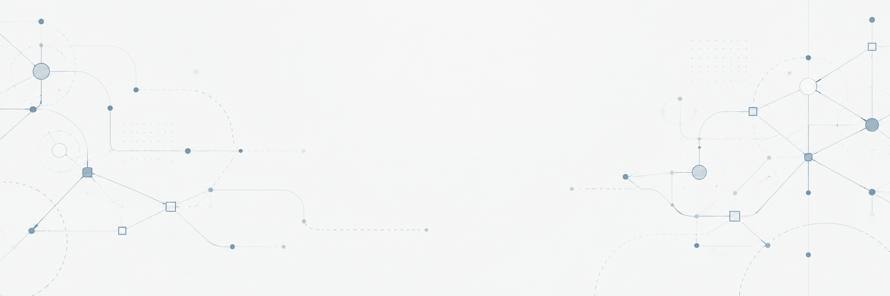

<p align="center">
  
</p>

<h1 align="center">Hi, I'm Uzair Khatri</h1>

<p align="center">
  <strong>Solutions Architect and AI Systems Engineer</strong><br />
  I turn fragile AI prototypes into observable, testable, production systems.
</p>

<p align="center">
  <a href="https://uzairkhatri.com"></a>
  <a href="https://www.linkedin.com/in/uzair-khatri/"></a>
  <a href="mailto:hello@uzairkhatri.com"></a>
  <a href="https://calendly.com/uz-khatri/30min"></a>
</p>

I have spent **14+ years** designing backend platforms, enterprise workflows, distributed services, and production AI systems. My current work sits at the intersection of **RAG quality**, **agent orchestration**, **event-driven architecture**, and **operational reliability**.

- Building production AI architectures with explicit evaluation, security, and observability boundaries
- Designing Python/FastAPI services, event streams, idempotent workers, and reliable data workflows
- Turning system-design decisions into runnable reference implementations, tests, and operational documentation
- Contributing fixes upstream when the problem belongs in the ecosystem rather than a local workaround

## Featured Projects

### [Production RAG Reference](https://github.com/uzairkhatri/production-rag-reference)

Provider-independent FastAPI reference architecture for measurable retrieval-augmented generation.

- Hybrid BM25 and dense retrieval with explicit reranking
- Grounded citations and deterministic value-presence checks
- Reproducible evaluation with Recall@5 and MRR quality gates in CI
- Local adapters for offline development and provider interfaces for production integration

[Repository](https://github.com/uzairkhatri/production-rag-reference) | [Architecture case study](https://uzairkhatri.com/work/production-rag/)

---

### [High-Throughput Event Platform](https://github.com/uzairkhatri/high-throughput-event-platform)

Runnable reference architecture for durable API ingestion and event processing.

- Kafka-compatible streaming with documented partition-key strategy
- Idempotent producers and consumers, bounded retries, and dead-letter handling
- PostgreSQL projections, Redis coordination, and OpenTelemetry instrumentation
- Docker Compose, Kubernetes manifests, CI, and a reproducible k6 load-test harness

```text
API clients -> FastAPI ingestion -> Event stream -> Partitioned workers
                    |                                    |
             Redis idempotency               PostgreSQL + DLQ + telemetry
```

[Repository](https://github.com/uzairkhatri/high-throughput-event-platform) | [Architecture decisions](https://github.com/uzairkhatri/high-throughput-event-platform/tree/main/docs/adrs)

---

### [Production AI Readiness](https://github.com/uzairkhatri/production-ai-readiness)

Deterministic CLI for auditing AI and LLM repositories before deployment.

- Checks evaluation, observability, guardrails, security, reliability, RAG quality, and cost controls
- Produces JSON, Markdown, and SARIF output for local use and CI workflows
- Converts production-readiness requirements into reviewable repository evidence

[Repository](https://github.com/uzairkhatri/production-ai-readiness) | [AI audit practice](https://uzairkhatri.com/services/ai-audit/)

---

### [FastAPI AI Engineering Team](https://github.com/uzairkhatri/fastapi-ai-team)

Multi-agent engineering workflow with specialized roles and explicit verification stages.

- Separate planning, backend, database, security, testing, and review responsibilities
- Structured handoffs instead of an unbounded prompt loop
- Reusable FastAPI architecture and delivery skills

[Repository](https://github.com/uzairkhatri/fastapi-ai-team)

## Open Source

### OpenTelemetry Python Contrib

I submitted [open-telemetry/opentelemetry-python-contrib#5111](https://github.com/open-telemetry/opentelemetry-python-contrib/pull/5111) to ensure Psycopg2 tracing remains active when applications pass a custom `cursor_factory` per cursor.

The contribution includes focused regression coverage, package-level validation, a changelog entry, and Linux Foundation CLA completion. It is currently **open and awaiting maintainer review**.

> I list upstream work by its real status: submitted while under review, merged only after maintainers merge it.

## Production Experience

| Product | System | Engineering focus |
| :--- | :--- | :--- |
| [Wellows](https://uzairkhatri.com/work/wellows/) | AI search visibility platform | Multi-agent workflows, retrieval, citation scoring, and production observability |
| [Savyour](https://uzairkhatri.com/work/savyour/) | Fintech and merchant platform | Distributed services, ledger workflows, partner APIs, and settlement processing |
| [EFU Life](https://uzairkhatri.com/work/efu-life/) | Regulated insurance workflows | Auditable workflow services, enterprise integration, and access controls |
| [ClassFlow](https://uzairkhatri.com/work/classflow/) | Live marketplace SaaS | Concurrency control, Redis coordination, matching, and payment workflows |

Detailed outcomes and project context are available in the [case studies](https://uzairkhatri.com/case-studies/).

## Engineering Toolkit

| Area | Tools and practices |
| :--- | :--- |
| **AI systems** | LangGraph, LangChain, OpenAI, Anthropic, Gemini, Qdrant, hybrid search, evaluation, guardrails |
| **Backend** | Python, FastAPI, Java, Spring Boot, TypeScript, PostgreSQL, Redis |
| **Distributed systems** | Kafka-compatible streams, SQS, RabbitMQ, idempotency, retries, DLQs, partitioning |
| **Operations** | AWS, Docker, Kubernetes, Terraform, GitHub Actions, OpenTelemetry, CloudWatch |
| **Architecture** | ADRs, API contracts, threat modeling, load testing, SLOs, failure-mode analysis |

## How I Build

1. Make system boundaries and failure modes explicit.
2. Measure retrieval and model behavior instead of relying on demos.
3. Keep nondeterministic AI behind deterministic controls.
4. Design retries, idempotency, and observability before incidents require them.
5. Publish claims only when the repository, test, or case study can support them.

## Now

- Improving the production RAG and event-platform reference architectures
- Contributing a Psycopg2 instrumentation fix to OpenTelemetry Python Contrib
- Researching a second upstream contribution without duplicating active work
- Writing about production AI architecture, evaluation, and reliability

## Activity

<p align="center">
  
  
</p>

## Connect

I work with teams moving AI prototypes into production and with engineering organizations that need stronger architecture, reliability, or delivery controls.

[Portfolio](https://uzairkhatri.com) | [Case studies](https://uzairkhatri.com/case-studies/) | [LinkedIn](https://www.linkedin.com/in/uzair-khatri/) | [Book a call](https://calendly.com/uz-khatri/30min) | [Email](mailto:hello@uzairkhatri.com)

<p align="center">
  <strong>Production AI | Grounded RAG | Distributed Systems | Reliable Delivery</strong>
</p>
